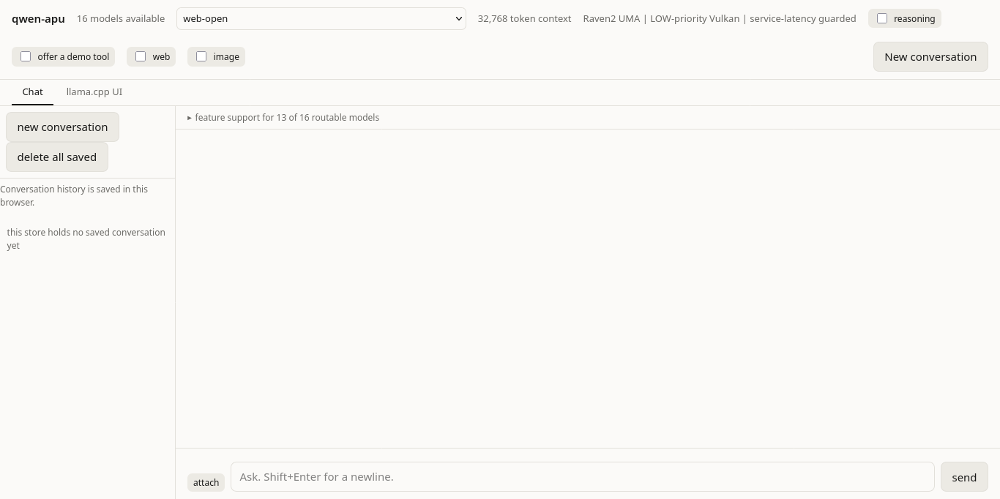

# Qwen APU

Local chat, image understanding, web retrieval, and image generation on a small
AMD laptop, powered by **llama.cpp and Vulkan**.

The target machine is an Athlon Silver 3050U: two CPU cores, two Vega compute
units, and 29 GiB of shared memory. The project keeps inference on the laptop
and provides a browser interface with model selection, saved conversations,
image attachments, and approval controls for tools. Web retrieval needs an
Internet connection; installed language and image models run locally.

**Start here:** [User guide](docs/USER-GUIDE.md) ·
[Installation](docs/INSTALL.md) · [Operator reference](WEBUI.md)
· [Models and tools](docs/MODELS-AND-TOOLS.md)



Actual appliance page in Firefox. Credential and service-address fields are
hidden for publication; the screenshot uses an empty disposable history.

## What you can do

| Task | How to use it | Practical limit |
| --- | --- | --- |
| Chat and coding | Choose a text model and send a message. | Larger models respond more slowly on this hardware. |
| Understand an image | Choose a vision model, attach an image, and ask about it. | Recognition works, but small text, counts, and measurements need checking. |
| Search or read the web | Choose a web-enabled model, enable **web**, and approve the requested operation. | Retrieval can fail; search snippets are different from a fetched page. |
| Read Wikipedia | Ask the web-enabled model to retrieve the specific Wikipedia source. | Wikipedia uses the web retrieval path; a failed fetch does not establish a sourced answer. |
| Generate an image | Enable **image**, describe the result, and inspect the approval dialog. | The admitted SDXS profile produces 512-pixel images with limited visual fidelity. |
| Review a generated image | Use the image card's review action. | A completed review can still make an incorrect visual judgment. |
| Keep conversations | Use the sidebar to reopen saved chats. | History belongs to that browser profile and origin; image pixels are omitted. |

The custom **Chat** page coordinates approvals, tools, and saved history.
The **llama.cpp UI** tab exposes the bundled upstream interface; its controls
and tool integration differ. Use Chat for the combined workflows in the guide.

## Use an installed laptop

Open the address supplied by the operator in Firefox. On an authenticated
installation, enter the appliance key when prompted. Keep that key private.
If the service is already running, opening the page is sufficient.

To start an installed appliance, run these commands in its checkout on the laptop:

```sh
make launch-readiness
remote/qwen-lan-launch.sh lan-authenticated low-async
```

Keep any operator-configured environment settings for the address, port, and
runtime root. Use the address printed by the launcher; installations can use
different ports. Readiness reports missing runtime inputs before launch.
An existing installation does not need its model weights or executable rebuilt
for each session.

To stop the appliance cleanly:

```sh
remote/qwen-teardown.sh
```

Teardown stops the owned services and restores their managed host settings.
It preserves downloaded models, installed environments, generated artifacts,
and saved browser conversations. **Uninstall and purge are separate removal
operations, not everyday shutdown commands.**

For a fresh installation, follow [Installation](docs/INSTALL.md). Bootstrap
creates the directory layout; the install and build steps supply the actual
models, dependencies, and deployment.

## Choose a model

Start with the 2B distill model for ordinary text. Try the 4B distill when you
need stronger formatting or reasoning and can wait longer. Choose an explicitly
vision-capable entry for attachments, and a web-enabled entry for retrieval.
The running picker's feature information is the source for available actions;
installing a model file alone does not qualify every feature.

The router normally loads one model at a time. Switching from chat to image
review can therefore take time. A slow first response after a switch can include
model loading as well as prompt processing.

## Files stay with the installation

Generated appliance files live under **`.runtime/`** in the checkout by default.
`QWEN_HOME` selects another declared runtime root. Models, deployments, service
state, caches, environments, and results live beneath that root. Browser history
is the exception: it lives in the browser profile for the page's origin.

The serving search environment is managed at
`$QWEN_HOME/opt/searxng/venv`; launchers select its interpreter automatically.
There is no requirement to activate one global `.venv` before chatting.
The model and image engines are native executables. Development tools have
separate environments and are not required just to start an installed service.

Inference runs as the ordinary user. Sudo supports declared machine-control
and restoration operations; it is not needed to lower a process to nice 19.
The installed sudo authentication-cache policy is an operator choice and does
not make the inference process root.

## Current limits and deployment status

Attachment ownership, saved-history deletion, image-omission notices, qualitative
vision recognition, image generation, and reviewer completion have passed live
checks. Recognition accuracy and generated-image quality remain imperfect.
A retained Wikipedia attempt failed required retrieval and produced the honest
incomplete-source result. A separate `docs.python.org` search and fetch produced
a grounded answer through `web-open`; the success does not reclassify the
Wikipedia result or establish general source availability.

The source includes explicit incomplete notices after failed web retrieval and
application-owned image controls. The compatibility correction passed CI and the updated page is deployed.
Remote Firefox has confirmed the explicit incomplete outcome after failed
required retrieval. A mixed Wikipedia-to-image sequence then completed one
image call: the verified card remained authoritative and a fabricated URL in
model prose stayed labeled unverified. Generated-image prose can remain
unreliable; Open, Download, Review, and Remove are application-owned controls.
The bounded record is
[`evidence/ui-tool-qualification-20260909/`](evidence/ui-tool-qualification-20260909/).
A merged change alone does not change the laptop's running page.

The serving bundle and inference executable remain fixed during this UI work.
Q8 timing remains held independently of product qualification: calibration arm
`09-P` measured `1,038,085 ns` across its full 748-row sampler denominator,
above the registered `1,000,000 ns` limit. The unchanged calibration and
candidate timing remain withheld until a registered input changes. The retained
analysis is
[`evidence/q8-attribution/calibration-20260908/`](evidence/q8-attribution/calibration-20260908/).
Historical
throughput figures are observations from particular runs, not promised response
rates for a busy laptop.

Authenticated HTTP controls access but does not encrypt traffic. Use a trusted
connection or an operator-configured encrypted transport. Browser credential
persistence and transport hardening remain separate work; this README does not
claim those changes have shipped.

## For maintainers

- [User guide](docs/USER-GUIDE.md): everyday workflows and troubleshooting.
- [Models and tools](docs/MODELS-AND-TOOLS.md): installed weights, live roster, validation, and guarded capabilities.
- [Installation requirements](docs/INSTALL.md): dependencies and provisioning.
- [Web UI operations](WEBUI.md): serving and deployment controls.
- [Technical background](docs/TECHNICAL-BACKGROUND.md): retained historical tables and analysis.
- [Evidence](evidence/): measurements, methods, and limitations.
- [Agent guide](AGENTS.md): repository rules and hardware constraints.

`webui/` contains the Chat page, `remote/` contains service and measurement code,
and `patches/` contains the pinned llama.cpp changes. Model weights and private
runtime records stay outside Git. Use the existing staging and deployment path
to update an appliance; editing the workstation checkout does not deploy it.
