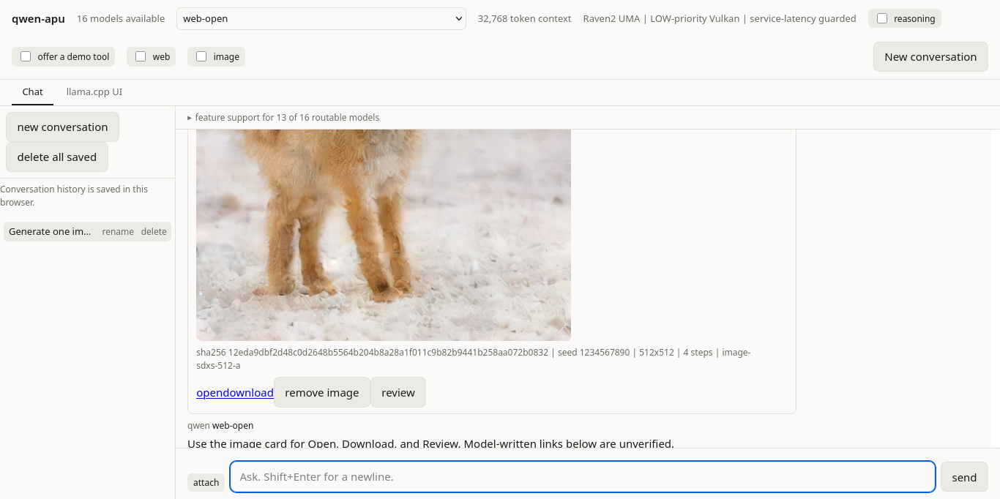

# qwen-apu user guide

This guide covers daily use of an installed qwen-apu appliance. Provisioning,
model installation, and deployment assembly belong in [INSTALL.md](INSTALL.md).


The screenshot shows the running appliance in Firefox with an empty test
history. Credential and service-address fields are hidden for publication.

## Start and stop the appliance

Run these commands from the appliance checkout. Keep `QWEN_HOME` set to the
runtime root used during installation.

```sh
export QWEN_HOME=${QWEN_HOME:-"$PWD/.runtime"}
make status
make launch-readiness
remote/qwen-lan-launch.sh lan-authenticated low-async
```

`make launch-readiness` checks the active deployment, models, search service,
and image runtime before launch. Open the URL printed by the launcher. Follow
the launcher's authentication instructions without copying credentials into
chat, notes, or screenshots.

Stop every appliance service with:

```sh
remote/qwen-teardown.sh
```

Teardown stops the serving processes and listeners. Teardown preserves models,
runtime logs, credentials, and conversations saved by the browser.

Run ordinary launch and teardown as the installation's user, **without sudo**.
Do not start the whole launcher with `nice -n 19`: the launcher keeps its
supervision processes at normal priority and lowers only inference. Lowering
inference priority needs no administrator permission. Hardware clock and power
experiments are separate administrative operations, not prerequisites for chat.

For an active image generation, use its `cancel` button to stop waiting. For a
stuck service, run `remote/qwen-teardown.sh` as the same installation user and
read its result before launching again. Do not use sudo to start a second copy
or kill an unrelated user's processes. A residue refusal needs its reported
process identity checked; repeated `sudo -v` is not ordinary recovery.

## Chat and choose a model

Use the `Model` picker at the top of the `Chat` tab. The picker shows the
models admitted by the active deployment. The badge beside a model reports its
tier, and `feature support` shows the features registered for each model.

Type a request in `Ask. Shift+Enter for a newline.` and select `send`. Press
Enter to send or Shift+Enter to add a line. Enable `reasoning` when you want the
page to show the model's reasoning stream. The model named on each assistant
message records which selection answered that turn.

A model change applies to the next request. If the model changes while an
approval or continuation is active, the page ends or refuses that operation
rather than sending one model's proposal to another model.

## Attach an image for vision

Select `attach` and choose an image. The attachment appears above the input;
remove an unwanted attachment there before selecting `send`. Choose a model
whose `feature support` row includes vision, then ask a concrete question about
the image.

The page sends an attachment only with that turn. Saved conversations retain
the attachment name and type but omit its pixels. After reopening a saved
conversation, the transcript says that the image pixels were omitted. Select
`attach` and add the image again before asking the model to continue using it.

## Search the web or Wikipedia

Select `web` for the turn and ask for current or sourced information. The model
may propose a search. `Authorize one web search` displays the exact query,
publication interval, included and excluded domains, result limit, and cache
policy. Read those fields before choosing `approve once` or `deny`.

An approval covers one displayed proposal. A later proposal opens another
dialog. For a Wikipedia-only request, confirm that `included domains` limits
the proposal to Wikipedia before approving it. Closing the dialog acts as a
denial. An unapproved call produces no search result, and the turn ends with
the incomplete source outcome described below.

With `web` selected, the page requires fetched source text before presenting a
source-grounded final answer. A refused, empty, expired, or failed retrieval
produces `Source retrieval is incomplete. No source-grounded answer was
produced.` Retry the request, approve a corrected proposal, or clear `web` and
ask a separate question based on the model's general knowledge. Do not treat a
failed retrieval as evidence for the requested claim.

The deployed UI reports the explicit incomplete outcome described above.
A remote Firefox check confirmed the outcome when the model skipped retrieval.

## Generate and review an image

Select `image`, describe the image, and select `send`. If the model proposes a
generation, `Authorize one image generation` displays the exact prompt,
negative prompt, seed, size, step count, and profile. Choose `approve once` to
run that proposal or `deny` to refuse it. The state line progresses through
`Approved`, `Generating image...`, and either `Image complete` or `Image
failed: ...`.

A completed generation appears in an application-owned card. Use `open` to
view it in a new tab, `download` to save it, `review` to ask the registered
vision reviewer to inspect it, or `remove image` to remove the live card and
its saved reference. Treat image links written in model prose as unverified.

Image generation and review already run in the live image lane. The canonical
card actions are deployed and have passed the automated browser tests.
A remote Firefox check also completed generation and verified Open and
Download in a fresh conversation. In the preceding mixed web/image conversation,
the model described image parameters without calling the tool. A prose proposal
alone does not mean an image was generated.



Detail of the actual generated-image card. The screenshot illustrates the
controls; generation completion does not guarantee image quality.

## Use saved conversations

The page saves conversations in the current browser profile for the page's
origin. Select a title in the left panel to reopen it. Use `rename` to change a
title and `delete` to remove that one saved conversation.

Select `new conversation` in the side panel, or `New conversation` in the top
bar, to open an empty conversation. The action preserves saved conversations.
An empty conversation becomes a saved record after its first message.

Select `delete all saved` to remove every saved conversation from that browser
after the confirmation prompt. The operation cannot be undone. If one browser
store cannot be cleared, the page reports `Saved conversation deletion is
incomplete` and lists the store outcomes instead of claiming full deletion.

Generated image bytes stay outside the conversation record. A saved generated
image keeps its digest, provenance route, seed, dimensions, steps, and profile.
When the conversation reopens, the page fetches the artifact again. A failed
fetch leaves the provenance and failure reason visible on the card.

## Troubleshooting

- A first reply after changing models can be slow because the router loads the
  selected model before processing the prompt. Wait for the active turn rather
  than sending the request again.
- `attach` also accepts text files. The page reads their text into the prompt
  and counts it against the selected model's context; text attachments do not
  require a vision model.
- `Source retrieval is incomplete` means the required retrieval did not finish
  successfully; other tool results may remain. Retry with a narrower request or clear `web` and ask a separate
  general-knowledge question.
- Conversation history belongs to one browser profile and page origin. A
  different browser, profile, hostname, scheme, or port has a different store.
